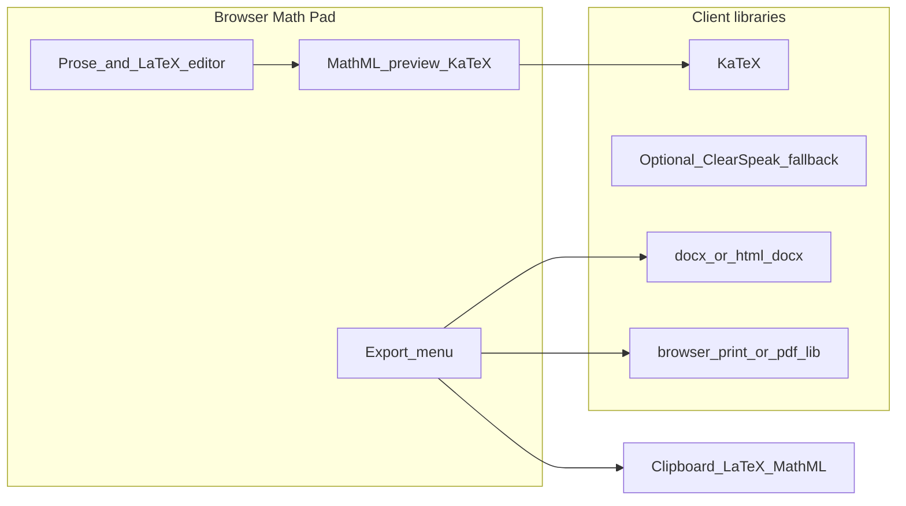

# Digi Math Pad — Product & Technical Plan

**Status:** Historical planning notes. Current product docs: [`pad/README.md`](../pad/README.md), [`math-pad-a11y-test.md`](math-pad-a11y-test.md).  
**Date:** 2026-09-02  
**Stack decision:** TypeScript (not Python) for the Pad UI.

---

## 1. Why this product

Blind/LV students need:

- Linear LaTeX practice aligned with Word muscle memory
- MathML so **NVDA / JAWS + MathCAT** can explore equations and drive **braille**
- A place that is not Google Docs’ canvas black box
- A way to **hand work in** (Word, PDF, Docs paste, link)

The Pad is that place. Docs/Word/PDF are **submission formats**, not the editing environment for accessible math.

---

## 2. What v1 is (and is not)

### v1 — ship this first

| Feature | Notes |
|---------|--------|
| Document = prose + LaTeX math blocks | Student writes steps and answers |
| Linear LaTeX input | Alt+= / familiar Word-style shortcuts where possible |
| Live MathML preview | KaTeX → MathML; `role="math"`; **no** aria-label that hides MathML |
| Screen-reader first UI | One focus order; no landmark spam; polite live regions only for status |
| Export **PDF** | Printable for teachers |
| Export **.docx** | Prose + OMML or MathML-in-Word where the library allows; else equation images + alt text as fallback |
| Copy LaTeX / Copy MathML | Clipboard for pasting into Docs/Overleaf |
| Local save | Browser localStorage or download `.digimath.json` |

### Explicitly not v1

- Google login / Classroom sync
- Collaborative editing
- “Native Google Docs equations” via undocumented APIs
- Replacing the Chrome extension overnight
- Full Overleaf (multi-file LaTeX projects)

### Later (v2+)

- Google account + “Export to Drive as Doc” (image or `[[eq]]` for graders who use the extension)
- Shareable read-only link for TVIs
- Introductory assignment templates
- Optional bridge: extension button “Open selection in Math Pad”

---

## 3. User story (school)

1. Teacher posts worksheet (Classroom / Doc / PDF).
2. Student opens **Digi Math Pad** in Chrome.
3. Types solutions in Linear LaTeX; arrows through MathML with JAWS/NVDA + braille.
4. Exports **Word** or **PDF** (or copies LaTeX) and submits in Classroom.

---

## 4. Architecture (v1)

**v1 is mostly a static/SPA front end.** No backend required to start. Optional later: small API for cloud save and Drive export.

---

## 5. Recommended languages & stack

### Recommendation for the project

| Layer | Choice | Why |
|-------|--------|-----|
| **UI language** | **TypeScript** | Safer than JS for a long-lived education product; same family as the extension |
| **UI framework** | **React** | Huge a11y ecosystem; or **Svelte** if you want less boilerplate — pick one and stick to it |
| **Math render** | **KaTeX** (already in this repo) | Fast; `output: 'mathml'` / htmlAndMathml for MathCAT |
| **Speech fallback** | Port `latex-speech.js` | When MathCAT unavailable (e.g. no SR) |
| **Word export** | **TypeScript** + `docx` library and/or HTML→docx with MathML where supported | OMML is XML; TS can generate it |
| **PDF export** | Browser **Print → PDF** first; later `pdf-lib` / server LaTeX if needed | Zero backend for v1 |
| **Build** | **Vite** | Fast, simple |
| **Hosting** | Static host (Cloudflare Pages, Netlify, GitHub Pages) | Cheap, school-friendly HTTPS |
| **Backend (v2)** | **TypeScript** (Node) **or** Python FastAPI | Prefer **one language** (TS) unless Drive/OAuth experts prefer Python |

### What not to use for v1

| Avoid | Reason |
|-------|--------|
| Electron desktop-first | Extra install friction for schools; web is enough |
| Full TeX Live server for every preview | Heavy; KaTeX covers the introductory curriculum |
| Fighting Docs canvas for editing | Already proven insufficient |
| PHP / Java for v1 | Fine later for IT shops; slows a small team now |

### Language summary (plain English)

- **TypeScript + React (or Svelte) + Vite + KaTeX** = the web app students use.  
- **Same TypeScript** for Word/PDF export helpers.  
- **No mandatory backend** until you need accounts or Google Drive.  
- Reuse **LaTeX → speech** and practice templates from this repo; do not rewrite the math pedagogy.

---

## 6. Accessibility rules (non-negotiable)

1. Equations exposed as **MathML**, not raw `\frac` in the reading surface.
2. Never put `role="img"` + long `aria-label` over MathML (hides MathCAT).
3. Linear box may echo characters (native SR); do **not** also announce full equation on every keystroke.
4. Shortcuts documented and testable with NVDA **and** JAWS + braille (Tina profile).
5. Acceptance: student can arrow into a quadratic formula and explore numerator/denominator via MathCAT — impossible in Docs; **required** in the Pad.

---

## 7. Export formats (honest)

| Format | Student use | Technical approach | Quality |
|--------|-------------|--------------------|---------|
| **PDF** | Teacher print / upload | Print CSS or html2pdf | High for sighted graders |
| **Word (.docx)** | IEP / Word classrooms | Generate docx; embed OMML when possible | Best path to JAWS-in-Word for *recipients* who open in Word |
| **Copy LaTeX** | Paste into Doc / Overleaf | Clipboard | Teachers with extension still see `[[eq]]` if they wrap it |
| **Google Doc** | Classroom | v2: Drive API upload of docx/pdf, or paste instructions | Not native Docs MathML |

Do not promise “export becomes a fully accessible native Google Doc equation.” Promise “teacher can grade; student authored accessibly.”

---

## 8. Relation to the Chrome extension

| Keep for now | Freeze / de-prioritize |
|--------------|------------------------|
| Insert `[[eq]]` for sighted/collab Docs | “Make Docs as accessible as Word” |
| Practice templates / speech tests | Dual-voice / MathML-in-Docs moonshots |
| Optional later: “Send to Math Pad” | Treating Docs as the SR workspace |

New work: **sibling app** (new repo recommended) or a dedicated `pad/` application under this project's own branding.

---

## 9. Suggested milestones

### Milestone A — Vertical slice (2–4 weeks)

- Blank Pad: textarea Linear LaTeX + MathML preview
- One introductory tutorial equation set
- NVDA + JAWS smoke test checklist
- Export PDF via print stylesheet

### Milestone B — Document model

- Multi-block doc (paragraphs + equation blocks)
- Save / load JSON
- Keyboard: new equation, edit, read

### Milestone C — Word export

- .docx download with equations
- Validate open in Word + JAWS if available

### Milestone D — Classroom packaging

- Project branding and TVI guide
- Optional Google sign-in + Drive upload

---

## 10. Risks

| Risk | Mitigation |
|------|------------|
| Schools only allow Google Docs | Pad = homework tool; export = submission |
| Word OMML generation is fiddly | Start PDF + LaTeX copy; improve docx |
| Scope creep (full LMS) | Hard v1 freeze above |
| Abandoning extension users | Keep extension for Docs insert; document Pad as accessible authoring |

---

## 11. Decision needed from you

1. **Repo:** new standalone repo vs `/pad` in this repo?  
2. **v1 export priority:** PDF-only first, or PDF + Word together?  
3. **UI library:** React (default) vs Svelte?

Once those three are answered, implementation can start with Milestone A.
